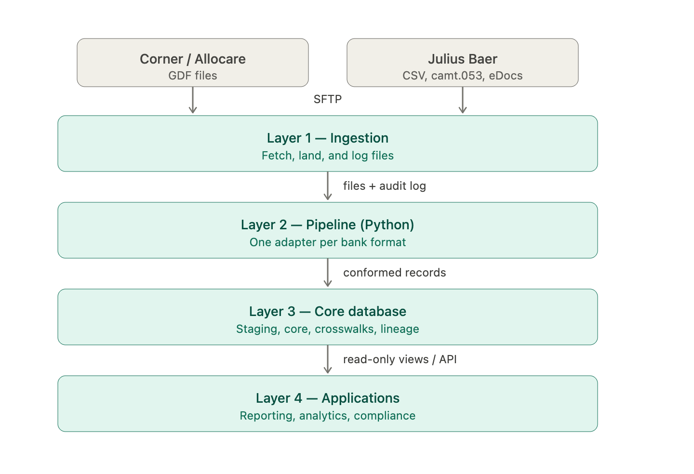

# Multi-Custodian Database

A consolidation database for an independent wealth manager that ingests custody and portfolio data
from more than one bank and turns it into a single, reconciled view. Today the two sources are
**Corner** (delivered as Allocare GDF files) and **Julius Baer** (delivered via BJB Digital Data
Services). The design's central goal is that adding a third bank later is a configuration and
adapter exercise, not a redesign.

This README is the high-level overview. Two companion documents hold the detail:

- **`requirements_analysis.md`** — the assumptions the design rests on and the functional /
  non-functional requirements.
- **`design/schema.md`** — the full logical schema (28 tables) with columns, keys, and constraints,
  for the engineer who will build it.

---

## The problem in one paragraph

A multi-bank manager receives a different data feed from every custodian, in a different format, on a
different schedule, with different identifiers and different codes for the same things. Allocare
sends wide tab-delimited files; Julius Baer sends CSV positions, ISO 20022 XML cash statements, and
zipped PDF documents. Nothing shares a key: the same security is a Valor at one bank and an ISIN at
another, and the same client is a portfolio name at one and an account number at the other. Without a
consolidation layer, producing a single cross-bank view of a client's holdings is manual,
error-prone, and slow. This system is that consolidation layer.

---

## Architecture at a glance



The principle running top to bottom: each bank's data stays in its native shape as long as possible,
is conformed to a common model exactly once, and is never merged blindly — overlapping figures are
*reconciled*, not silently combined.

---

## Layer 1 — Ingestion

**What it does.** Collects files from each bank, places them in a landing area without altering them,
and records every arrival. Each bank publishes to an SFTP location; the system connects on a
schedule, pulls whatever is new, and writes one audit record per file — name, source, version,
timestamp, row count, and outcome. Expected gaps are understood (Julius Baer delivers Tuesday to
Saturday, reflecting the previous business day), so a quiet weekend is normal while a missing weekday
file is flagged.

**Technology.** Standard SFTP over SSH with key-based authentication and fixed-IP whitelisting, as
the banks require. (Julius Baer mandates a specific set of encryption algorithms from 28 June 2026 —
noted because it affects onboarding timing.) Scheduling is handled by a lightweight scheduler — cron
for a small deployment, or an orchestrator such as Prefect or Airflow if richer dependency control is
wanted later. The landing area is the filesystem or object storage; the audit trail is a table in the
database.

**How it connects to the next layer.** Ingestion's only job is delivery and record-keeping. Once a
file is landed and logged, the pipeline takes over by reading from the landing area and the audit
log — never from the banks directly. This separation means a day can be reprocessed from landed files
without re-fetching anything.

## Layer 2 — Pipeline

**What it does.** Turns raw files into validated, conformed records. Each format has its own
**parser** — one for Allocare GDF, one for the BJB positions/transactions CSV, one for camt.053 XML,
one for the eDocs index — and every parser produces the same canonical record shapes. Those records
then pass through a shared sequence: **transform** (resolve identifiers to internal keys, map each
bank's codes to one common vocabulary, convert dates and numbers, treat placeholders like `Unknown`
as missing), **validate** (reject malformed rows into a quarantine with a reason, load the rest), and
**load** (write to the database, applying inserts/updates/deletes and preserving the link from every
record back to the file it came from).

**Technology.** Python, for its strength in exactly this kind of file and data work — `pandas` for
tabular feeds, the standard XML and CSV libraries for camt and eDocs, schema validation for the
quality gate, and SQLAlchemy for loading. The parsers follow the **adapter pattern**: each implements
a common interface (`fetch → parse → emit canonical records`), so the transform, validate, and load
stages are written once and shared. Adding a bank means writing one new adapter, not touching the
core pipeline — this is the design's main extensibility claim, and Phase 5 exists to prove it.

**How it connects to the next layer.** The pipeline is the only component that writes to the core
database. It reads landed files and writes conformed rows, so the database never depends on knowing
anything about file formats. Format changes and new banks are absorbed here, behind a stable
interface to the data below.

## Layer 3 — Core database

**What it does.** Holds all custody data in one unified schema (28 tables) that every bank maps into.
It is organised in three bands. A **staging band** keeps each feed in its raw, as-delivered form, so
there is always an exact record of what arrived. A **conformed core** holds the consolidated business
data: the instruments (securities and their many identifiers, names, and features), the portfolios
and their cash and custody accounts, the transactions and their movements, the dated position
snapshots, the cash statements and bookings from camt.053, market rates, and the register of client
documents. A **cross-cutting band** makes two banks behave as one: identity crosswalks that map every
bank's instrument and account identifiers to common internal keys, a code dictionary that harmonises
each bank's vocabulary, a reconciliation area that compares overlapping figures and queues
discrepancies, and a lineage trail tying every row back to its source file.

**Technology.** A single relational database — PostgreSQL or Microsoft SQL Server are both natural
fits (SQL Server is the closer match, since Allocare itself runs on it). The data volumes for a firm
of this size sit comfortably on a single server with no special scaling machinery. Positions are
stored as the banks deliver them rather than recalculated, so the custodian's official figures remain
the reference; reconciliation compares them against transaction history as a control.

**How it connects to the next layer.** Applications read from the core — never write to it — through
query-friendly views and, where useful, a thin read API. Because the core is already conformed and
reconciled, an application asks for "this client's consolidated positions" without caring which bank
each line came from.

## Layer 4 — Applications

**What it does.** Everything the consolidated data makes possible, built on top without changing
anything beneath it. The obvious first use is **consolidated reporting** — a single cross-bank view of
a client's holdings, cash, and transactions, in the portfolio's reference currency. Beyond that:
**simulation** (model the effect of a trade or reallocation against current holdings),
**analytics** (exposure, allocation, and performance inputs across all banks at once), and
**compliance and audit** (because every figure traces back to a source file, and reconciliation
exceptions are recorded and tracked).

**Technology.** Off-the-shelf business-intelligence tools (Power BI, Metabase) can sit directly on the
reporting views; bespoke applications can use the read API. The point is that this layer is
deliberately thin and replaceable — the value lives in the conformed data below it, so the firm can
choose and change its reporting tools freely.

---

## Implementation roadmap

Five phases, each delivering something usable on its own. Indicative durations assume one developer
and are ranges, not commitments — the second-bank work in particular depends on two answers still
outstanding from the firm (see *Open questions* below).

### Phase 1 — Foundation *(indicative: 3–4 weeks)*

Stand up the database and get Corner/Allocare data flowing end to end. This means creating the schema,
building the ingestion connection to Allocare's SFTP, writing the GDF parser and the shared transform/
validate/load pipeline, and loading the in-scope Allocare files (instruments, portfolios, accounts,
transactions, positions). **Done when** an Allocare delivery can be fetched, parsed, and loaded
automatically, and a person can query a portfolio's positions and transactions from the database.
This phase also proves the core schema against real data before a second source is added.

### Phase 2 — Second bank *(indicative: 3–5 weeks)*

Add Julius Baer alongside Allocare. This means writing the BJB adapters (CSV positions/transactions,
camt.053 cash, eDocs documents), building the **identity crosswalk** that links the two banks'
instruments and accounts, and standing up **reconciliation** so overlapping figures (cash especially)
are compared rather than double-counted. **Done when** a client held at both banks shows a single,
correct consolidated view, and any mismatch surfaces as a tracked exception rather than a silent
error. This is the phase that validates the whole multi-bank premise.

### Phase 3 — Hardening *(indicative: 2–3 weeks)*

Make it operationally dependable. This means robust handling of malformed files and partial loads,
monitoring of the daily schedule (so a missing weekday file raises an alert while a quiet weekend does
not), alerting on failures and on open reconciliation breaks, and the ability to reprocess any day
from landed files without re-fetching. **Done when** the firm can trust the feed to run unattended and
be told promptly when something needs attention.

### Phase 4 — Applications *(indicative: 3–4 weeks)*

Deliver the first reporting and analytics layer. This means building the reporting views and
connecting a BI tool, producing the consolidated cross-bank client report, and adding a first
analytical view (allocation/exposure across all banks). **Done when** the interviewer's team can open
a dashboard and read a consolidated client picture without writing a query. Simulation and richer
analytics build on the same foundation afterwards.

### Phase 5 — Extensibility *(indicative: 1–2 weeks for a comparable feed)*

Demonstrate that a third bank is an adapter, not a project. This means onboarding an additional
custodian by writing one new parser against the existing pipeline and extending the crosswalk and code
dictionary — with no change to the core schema or the shared transform/validate/load stages. **Done
when** the new bank's data flows into the same consolidated view as the first two, proving the
adapter pattern in practice.

---

## Open questions affecting the plan

Two answers from the firm shape Phase 2 and should be settled early:

1. **Ingestion route.** Does Julius Baer data arrive directly, or does it flow into Allocare first
   and reach us as GDF? The design assumes the harder, direct case; if BJB flows through Allocare,
   Phase 2 shrinks substantially (the CSV/XML/ZIP adapters are not needed).
2. **BJB feed layout.** The exact column layout of the Julius Baer positions/transactions CSV is not
   yet in hand; the BJB-specific tables and crosswalk mappings are finalised when it arrives.

A third, smaller question — which source is authoritative for cash when both banks report it —
affects only how reconciliation resolves, not the structure.

---

## Repository contents

```
README.md                 ← this document
requirements_analysis.md  ← assumptions and requirements
design/
  schema.md               ← full logical schema (28 tables)
```